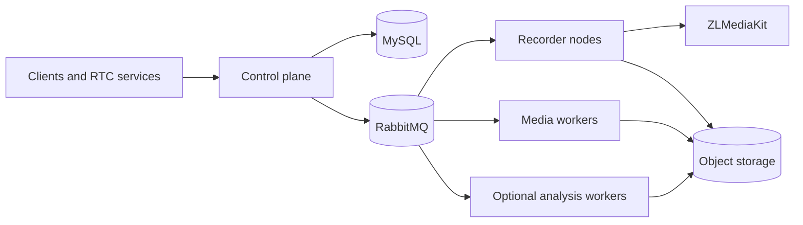

# MediaFleet

MediaFleet is a distributed media orchestration, recording, and processing
platform. It coordinates multiple control-plane instances, ZLMediaKit-backed
recording units, horizontally scalable media workers, and optional AI analysis
services from one repository.

> Project status: pre-release. The runtime architecture is functional, while
> public APIs, packaging, and operator workflows are still being stabilized.

## What it provides

- Multi-instance control plane backed by MySQL facts.
- Sticky stream-to-node bindings and capacity-aware scheduling.
- Node-directed recording commands for ZLMediaKit recording units.
- Durable RabbitMQ task delivery with retries, dead-letter queues, and
  idempotent consumers.
- Shared media workers for video, audio, offline ASR, and optional analysis.
- Independent deployment and scaling for every runtime role.
- A built-in operations console, with CLI and MCP adapters on the roadmap.

## Runtime components

| Component | Default port | Responsibility |
| --- | ---: | --- |
| `control-center` | 8008 | APIs, scheduling, task dispatch, bindings, and operations UI |
| `media-worker` | 8009 | Shared video, audio, offline ASR, and media-processing tasks |
| `recorder-node` | 8010 | Controls local ZLMediaKit and processes local recordings |
| `content-analysis` | 8012 | Optional content-analysis workflows and checkpointed execution |



## Repository layout

```text
services/
  control_center/       Control-plane API and operations console
  recorder_node/       Node-directed recording and local post-processing
  media_worker/        Shared media task consumers
  content_analysis/    Optional content-analysis service
media_platform/        Shared domain contracts and infrastructure adapters
alembic/               Versioned database migrations
deploy/                Dockerfiles and Compose examples
docs/                  Architecture, operations, and roadmap documentation
tests/                 Unit, contract, and integration tests
```

Offline ASR remains part of `media-worker`; MediaFleet does not introduce a
separate ASR relay service.

## Local development

Requirements:

- Python 3.10-3.12
- [uv](https://docs.astral.sh/uv/)
- MySQL 5.7+
- RabbitMQ
- FFmpeg for recording and media-processing roles

Install the base development environment:

```bash
uv sync --frozen
```

Install service-specific dependencies when needed:

```bash
uv sync --frozen --extra recorder-node
uv sync --frozen --extra media-worker
uv sync --frozen --extra content-analysis
```

Copy only the example configuration required by the service you are running.
Never commit a populated `.env` file.

```bash
cp services/control_center/.env.example services/control_center/.env
cp services/media_worker/.env.example services/media_worker/.env
cp services/recorder_node/.env.example services/recorder_node/.env
cp services/content_analysis/.env.example services/content_analysis/.env
```

Start services in separate terminals:

```bash
uv run python -m services.control_center.main
uv run python -m services.media_worker.main
uv run python -m services.recorder_node.main
uv run python -m services.content_analysis.main
```

## Verification

```bash
uv run python -m pytest -q
uv run python -m compileall media_platform services
docker compose --env-file .env.example -f deploy/compose/docker-compose.yml config --quiet
```

## Security

MediaFleet does not ship credentials, model weights, proprietary fonts, or
environment-specific deployment data. See [SECURITY.md](SECURITY.md) and
[configuration and secrets](docs/security/configuration-and-secrets.md).

## Documentation

- [Architecture overview](docs/architecture/overview.md)
- [Interfaces: REST, CLI, and MCP](docs/architecture/interfaces.md)
- [Configuration and secrets](docs/security/configuration-and-secrets.md)
- [Dependency license review](docs/security/dependency-licenses.md)
- [Docker Compose deployment](docs/deployment/docker-compose.md)
- [Roadmap](docs/roadmap.md)

## License

MediaFleet source code is licensed under the [MIT License](LICENSE). Optional
dependencies, external runtimes, and downloaded models retain their own
licenses; see [THIRD_PARTY_NOTICES.md](THIRD_PARTY_NOTICES.md).
