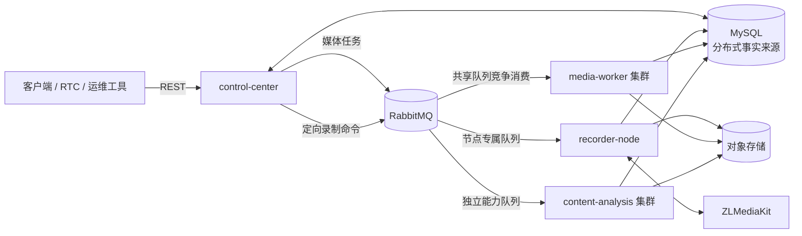

# MediaFleet

MediaFleet 是一个面向多节点部署的媒体调度、录制与处理平台。项目由可独立部署和横向
扩展的控制中心、录制节点、通用媒体 Worker 与内容分析服务组成，并以持久状态和可靠
消息支持跨节点任务调度与故障恢复。项目演进背景见[项目背景与演进](docs/project-background.md)。

> 当前版本：`0.1.0`，处于内部预发布阶段。核心运行链路已经具备，API、SDK、CLI、
> MCP 和运维能力仍会继续稳定；完成公开发布检查前，仓库应保持 Private。

## 核心能力

- 以 MySQL 持久化事实为基础的多实例控制中心。
- 支持粘性流绑定、容量感知调度与录制单元运维状态管理。
- 将录制命令定向投递到拥有对应 ZLMediaKit 和录像文件的录制节点。
- 使用 RabbitMQ 实现持久消息、发布确认、手动确认、有限重试和死信队列。
- 通过共享队列横向扩展视频、音频、离线 ASR 和对象检测任务。
- 将内容分析作为独立能力池部署，避免与通用媒体计算相互争抢资源。
- 提供 REST API 和轻量运维控制台，并规划统一 SDK、CLI 与 MCP 适配器。

## 系统组成

| 组件 | 默认端口 | 主要职责 | 扩展方式 |
| --- | ---: | --- | --- |
| `control-center` | 8008 | API、节点调度、流绑定、任务与命令投递、运维控制台 | 多实例无状态扩展，共享 MySQL 与 RabbitMQ |
| `recorder-node` | 8010 | 控制本机 ZLMediaKit、读取本机录像、完成录制后处理 | 每个录制单元使用稳定节点 ID 独立部署 |
| `media-worker` | 8009 | 视频、音频、离线 ASR、对象检测等通用任务 | 多实例竞争消费同一持久队列 |
| `content-analysis` | 8012 | 可选的内容分析与检查点式执行 | 使用独立队列和独立计算池扩展 |



MySQL 保存节点、绑定、任务、投递状态和媒体产物等持久事实。RabbitMQ 负责可靠传输，
但不作为唯一状态来源。Redis 和进程内状态只允许用于缓存或局部协调。

## 仓库结构

```text
services/
  control_center/       控制中心 API、调度与运维控制台
  recorder_node/        定向录制、本机文件处理与结果恢复
  media_worker/         通用媒体任务消费者与处理器注册表
  content_analysis/     可选内容分析服务
media_platform/
  application/          可被 REST、CLI、MCP 等入口复用的应用服务
  contracts/            跨服务消息契约与 RabbitMQ 稳定命名
  domain/               不依赖框架的领域模型和规则
  infrastructure/       MySQL、RabbitMQ、存储、媒体工具等适配器
alembic/                数据库迁移
deploy/                 Dockerfile 与 Compose 部署示例
docs/                   中文架构、开发、部署、安全和路线图文档
tests/                  单元、契约和服务边界测试
```

## 快速开始

环境要求：Python 3.10–3.12、[uv](https://docs.astral.sh/uv/)、MySQL 5.7+、
RabbitMQ。录制节点和媒体 Worker 还需要 FFmpeg；录制链路需要可访问的 ZLMediaKit。

```bash
uv sync --frozen
uv sync --frozen --extra recorder-node
uv sync --frozen --extra media-worker
uv sync --frozen --extra content-analysis
```

只复制需要运行的服务配置，不要提交填写过真实值的 `.env`：

```powershell
Copy-Item services/control_center/.env.example services/control_center/.env
Copy-Item services/media_worker/.env.example services/media_worker/.env
Copy-Item services/recorder_node/.env.example services/recorder_node/.env
Copy-Item services/content_analysis/.env.example services/content_analysis/.env
```

在不同终端启动服务：

```bash
uv run python -m services.control_center.main
uv run python -m services.media_worker.main
uv run python -m services.recorder_node.main
uv run python -m services.content_analysis.main
```

控制中心接口文档位于 `http://127.0.0.1:8008/api/docs`，运维控制台位于
`http://127.0.0.1:8008/admin/`。

## 开发与验证

```bash
uv run python -m pytest -q
uv run python -m compileall media_platform services alembic
docker compose --env-file .env.example -f deploy/compose/docker-compose.yml config --quiet
```

新增功能前请先阅读[文档导航](docs/README.md)和[扩展开发指南](docs/development/extending-mediafleet.md)。
涉及消息契约时，必须同时检查所有生产者与消费者；涉及持久状态时，必须提供 Alembic
迁移并说明升级与回滚影响。

## 文档

- [文档导航](docs/README.md)
- [项目背景与演进](docs/project-background.md)
- [总体架构](docs/architecture/overview.md)
- [服务边界与依赖规则](docs/architecture/service-boundaries.md)
- [数据一致性与消息可靠性](docs/architecture/data-and-messaging.md)
- [REST、SDK、CLI 与 MCP 接口架构](docs/architecture/interfaces.md)
- [架构决策记录](docs/decisions/README.md)
- [扩展开发指南](docs/development/extending-mediafleet.md)
- [Docker Compose 部署](docs/deployment/docker-compose.md)
- [路线图](docs/roadmap.md)

## 安全与许可证

项目不会随源码分发凭据、模型权重、专有字体或特定环境部署数据。安全问题请按
[安全策略](SECURITY.md)私下报告。MediaFleet 源代码采用 [MIT License](LICENSE)，
外部运行时、依赖和模型保留各自许可证，详见[第三方组件说明](THIRD_PARTY_NOTICES.md)。

## 参与贡献

请阅读[贡献指南](CONTRIBUTING.md)和[行为准则](CODE_OF_CONDUCT.md)。提交 Pull Request
时应说明问题、设计选择、验证结果，以及对部署、数据迁移和兼容性的影响。
