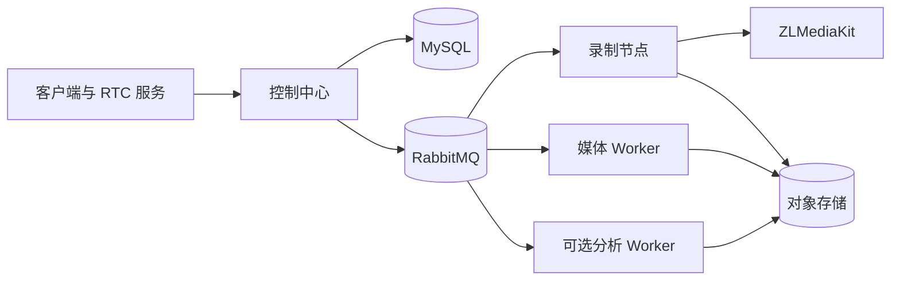

# MediaFleet

[English](README.md) | [简体中文](README.zh-CN.md)

MediaFleet 是一个分布式媒体调度、录制与处理平台。它在同一个仓库中组织多实例控制中心、基于 ZLMediaKit 的录制单元、可横向扩展的媒体 Worker，以及可选的 AI 分析服务。

> 项目状态：预发布。核心运行架构已经可用，公开 API、软件包和运维流程仍在持续稳定中。

## 核心能力

- 以 MySQL 持久化事实为基础的多实例控制中心。
- 支持粘性流绑定和容量感知的节点调度。
- 面向指定 ZLMediaKit 录制单元的定向录制命令。
- 基于 RabbitMQ 的可靠任务投递、有限重试、死信队列和幂等消费。
- 支持视频、音频、离线 ASR 和可选分析任务的共享媒体 Worker。
- 各运行角色均可独立部署和横向扩展。
- 内置运维控制台，并计划提供 CLI 与 MCP 适配器。

## 运行组件

| 组件 | 默认端口 | 职责 |
| --- | ---: | --- |
| `control-center` | 8008 | API、节点调度、任务投递、绑定管理和运维控制台 |
| `media-worker` | 8009 | 共享视频、音频、离线 ASR 和媒体处理任务 |
| `recorder-node` | 8010 | 控制本地 ZLMediaKit 并处理本地录像文件 |
| `content-analysis` | 8012 | 可选的内容分析工作流和检查点式执行 |



## 仓库结构

```text
services/
  control_center/       控制中心 API 与运维控制台
  recorder_node/        定向录制与节点本地后处理
  media_worker/         共享媒体任务消费者
  content_analysis/    可选内容分析服务
media_platform/        共享领域契约与基础设施适配器
alembic/               版本化数据库迁移
deploy/                Dockerfile 与 Compose 示例
docs/                  架构、运维和路线图文档
tests/                 单元、契约和集成测试
```

离线 ASR 始终属于 `media-worker`，MediaFleet 不会引入独立的 ASR 中转服务。

## 本地开发

环境要求：

- Python 3.10–3.12
- [uv](https://docs.astral.sh/uv/)
- MySQL 5.7+
- RabbitMQ
- 录制节点和媒体处理节点需要 FFmpeg

安装基础开发环境：

```bash
uv sync --frozen
```

按需安装服务专用依赖：

```bash
uv sync --frozen --extra recorder-node
uv sync --frozen --extra media-worker
uv sync --frozen --extra content-analysis
```

只复制准备运行的服务所需的配置示例。不要提交填写过真实配置的 `.env` 文件。

```bash
cp services/control_center/.env.example services/control_center/.env
cp services/media_worker/.env.example services/media_worker/.env
cp services/recorder_node/.env.example services/recorder_node/.env
cp services/content_analysis/.env.example services/content_analysis/.env
```

在不同终端中启动服务：

```bash
uv run python -m services.control_center.main
uv run python -m services.media_worker.main
uv run python -m services.recorder_node.main
uv run python -m services.content_analysis.main
```

## 验证

```bash
uv run python -m pytest -q
uv run python -m compileall media_platform services
docker compose --env-file .env.example -f deploy/compose/docker-compose.yml config --quiet
```

## 安全

MediaFleet 不随源码分发凭据、模型权重、专有字体或特定环境的部署数据。请参阅 [SECURITY.md](SECURITY.md) 和[配置与密钥说明](docs/security/configuration-and-secrets.md)。

## 文档

- [架构概览](docs/architecture/overview.md)
- [REST、CLI 与 MCP 接口规划](docs/architecture/interfaces.md)
- [配置与密钥管理](docs/security/configuration-and-secrets.md)
- [依赖许可证审查](docs/security/dependency-licenses.md)
- [Docker Compose 部署](docs/deployment/docker-compose.md)
- [路线图](docs/roadmap.md)

## 许可证

MediaFleet 源代码采用 [MIT License](LICENSE)。可选依赖、外部运行时和另行下载的模型保留各自许可证，详情参阅 [THIRD_PARTY_NOTICES.md](THIRD_PARTY_NOTICES.md)。
