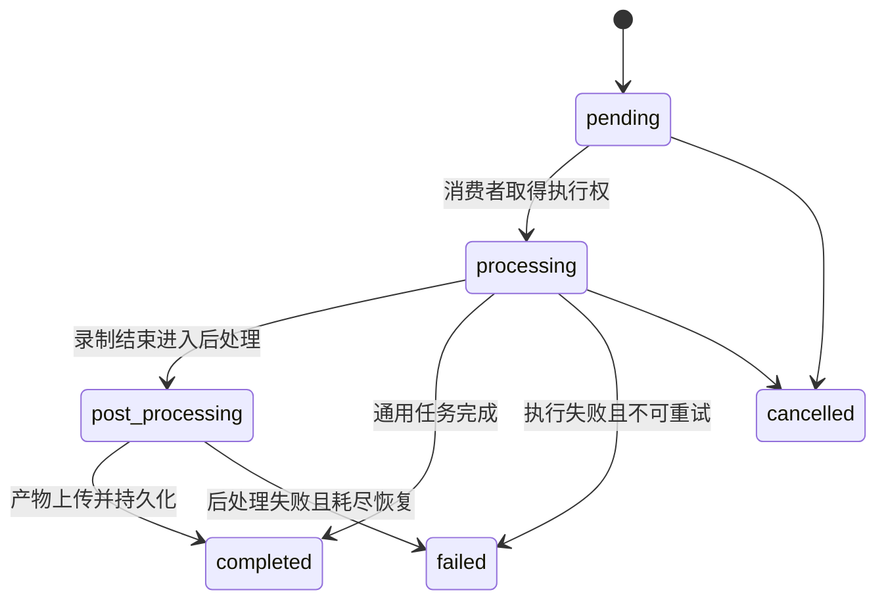

# 数据一致性与消息可靠性

## 1. 一致性模型

MediaFleet 使用 MySQL 记录业务事实，RabbitMQ 提供至少一次传输。两者之间当前采用
“先写数据库、后台领取发布、发布确认后更新状态”的持久意图模式。它不是跨资源的分布式
事务，因此发布和状态确认之间可能发生故障；系统通过稳定消息 ID、重新领取和消费者幂等
消除不确定窗口。

## 2. 权威数据

MySQL 至少保存以下事实：

- 媒体节点、节点类型、心跳、就绪状态、容量和运维状态；
- 流与录制单元的粘性绑定；
- 任务参数、状态、优先级、重试次数、执行节点、租约和结果；
- 任务或录制命令的待发布、已领取、已发布和失败状态；
- 录像、音频、封面等媒体产物元数据；
- 内容分析步骤、提示词版本和恢复检查点。

RabbitMQ 队列深度、消费者连接或 Redis 键都不能单独用来判断业务最终状态。

## 3. 消息信封

跨服务消息继承统一信封：

| 字段 | 用途 |
| --- | --- |
| `schema_version` | 契约版本，发生不兼容变更时用于路由迁移 |
| `message_id` | 一次逻辑投递的稳定唯一编号，AMQP 属性必须与正文一致 |
| `trace_id` | 串联 API、数据库和消息日志 |
| `source` | 消息来源服务 |
| `created_at` | 带时区的 UTC 创建时间 |
| `idempotency_key` | 业务操作去重键 |

契约模型拒绝未知字段，以便尽早发现协议漂移。敏感凭据、签名 URL 和带认证信息的
RTSP URL 不得进入消息正文或日志。

## 4. RabbitMQ 拓扑

| 通道 | 主 Exchange | 主要队列/路由 | 使用场景 |
| --- | --- | --- | --- |
| 通用任务 | `media.task` | `media-worker.tasks`，默认绑定 `#` | 等价媒体 Worker 竞争消费 |
| 内容分析 | `content.analysis.task` | `content-analysis.tasks` | 独立内容分析能力池 |
| 录制命令 | `media.command` | `recorder.<node_id>.commands` | 定向到文件所有者节点 |
| 媒体事件 | `media.event` | `control-center.media-events` | 完成、失败等领域事件 |

每类通道都有独立 Retry Exchange、延迟重试队列、Dead Letter Exchange 和最终 DLQ。
拓扑稳定名称集中定义在 `media_platform/contracts/topology.py`，服务不能自行复制字符串。

## 5. 生产者规则

1. 先在 MySQL 中持久化业务任务或命令意图。
2. 通过条件更新领取一批待发布记录，领取需要实例 ID 和过期时间。
3. 使用持久消息、`mandatory` 路由和 Publisher Confirm 发布。
4. 仅在 Confirm 成功且 `message_id` 匹配后标记已发布。
5. 发布失败时释放领取，保留稳定 `message_id`，由后续扫描重新发布。

新增生产者时，不允许在 HTTP 请求内只发布 RabbitMQ 而不保存可恢复意图。

## 6. 消费者规则

1. 使用手动 ACK 和有限 `prefetch`，避免单实例拿走过多长任务。
2. 解析消息后校验正文与 AMQP `message_id` 一致，并校验目标节点或任务类型。
3. 通过 MySQL 条件状态迁移领取执行权；已完成或已由新代次接管的消息视为幂等命中。
4. 周期性续租长任务，提交结果时校验执行代次或租约所有者。
5. 只有持久结果提交成功后才 ACK。
6. 可恢复错误转入有限延迟重试；永久错误或耗尽次数的消息进入 DLQ。
7. 如果重试或死信转发本身失败，对原消息 `requeue=True`，避免基础设施抖动造成丢失。
8. 数分钟长任务不能占用 Pika I/O 线程；处理逻辑放入独立线程，最终 ACK、重试或死信操作
   通过线程安全回调返回原连接线程执行。

## 7. 状态机

媒体任务主要状态为：

投递状态与业务状态分开维护：`PENDING → CLAIMED → PUBLISHED`，不可恢复的数据错误可进入
`FAILED`。不要用“消息已发布”代表“任务执行完成”。

## 8. 契约变更流程

兼容变更可以新增带默认值的可选字段。不兼容变更需要：

1. 提升 `schema_version`；
2. 列出并修改所有生产者和消费者；
3. 在滚动升级期间支持新旧版本并明确升级顺序；
4. 更新契约测试、拓扑文档和部署说明；
5. 为无法处理的旧消息制定排空、迁移或 DLQ 处理方案。

任何消息字段或路由修改都不得只改一端。
