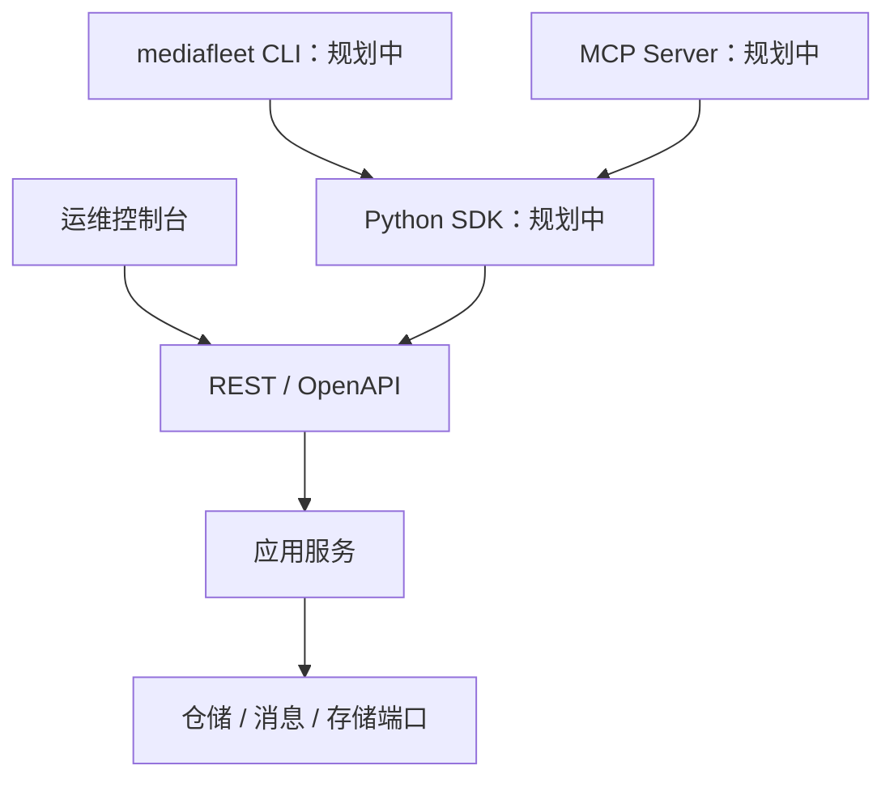

# REST、SDK、CLI 与 MCP 接口架构

MediaFleet 使用一套应用用例和多种入口适配器。REST 是稳定远程契约；规划中的 Python SDK
封装 REST；CLI、MCP 和运维控制台通过 SDK 或相同 REST 语义调用，统一鉴权、授权、审计、
幂等和错误处理。

## 当前接口

控制中心提供任务、节点、心跳、流绑定、录制命令、录制单元和运维管理 API，并暂时保留
部分旧业务兼容路由。OpenAPI 文档默认位于 `/api/docs`，健康检查位于 `/health`，运维页面
位于 `/admin/`。

路由层负责协议解析、鉴权和响应映射；任务创建、调度、状态查询等业务流程应放在应用服务，
便于后续 SDK、CLI、MCP 和测试复用。

## SDK 规划

Python SDK 应提供类型化请求和响应、超时、重试、幂等键、分页、错误分类和 API 版本处理。
SDK 不直接连接 MySQL 或 RabbitMQ，也不读取服务端本地文件。

## CLI 要求

计划中的 `mediafleet` 命令应具备：

- 稳定退出码和可机器读取的 `--json` 输出；
- 非交互运行方式，适合 CI 和运维脚本；
- 健康、节点、绑定、任务、录制、产物和允许列表配置等命令；
- 从环境变量、受保护配置文件或操作系统凭据库读取认证信息；
- 变更操作支持显式参数、幂等键和可审计请求身份。

凭据不能被强制放在会出现在进程列表或 Shell 历史中的命令行参数中。

## MCP 要求

MCP Server 独立部署并通过 SDK 访问控制中心。工具应小而明确，默认只启用只读工具；变更
工具需要范围化授权、稳定幂等键和审计记录。

MCP 不提供任意 SQL、Shell、文件系统访问、RabbitMQ 发布或环境变量修改工具。面向模型的
返回值应精简、结构化，并明确区分业务失败、权限失败和基础设施暂时不可用。

## 接口演进

- 新增字段优先保持向后兼容，并为可选字段提供清晰默认语义。
- 删除或改变字段前先标记废弃，说明替代接口和计划移除版本。
- 写操作支持调用方幂等键，避免网络重试重复创建任务。
- 长任务返回 `task_id`，由查询或事件获取结果，不保持长时间 HTTP 连接。
- 所有入口必须经过同一授权和审计边界，不能因 CLI 或 MCP 获得旁路权限。
