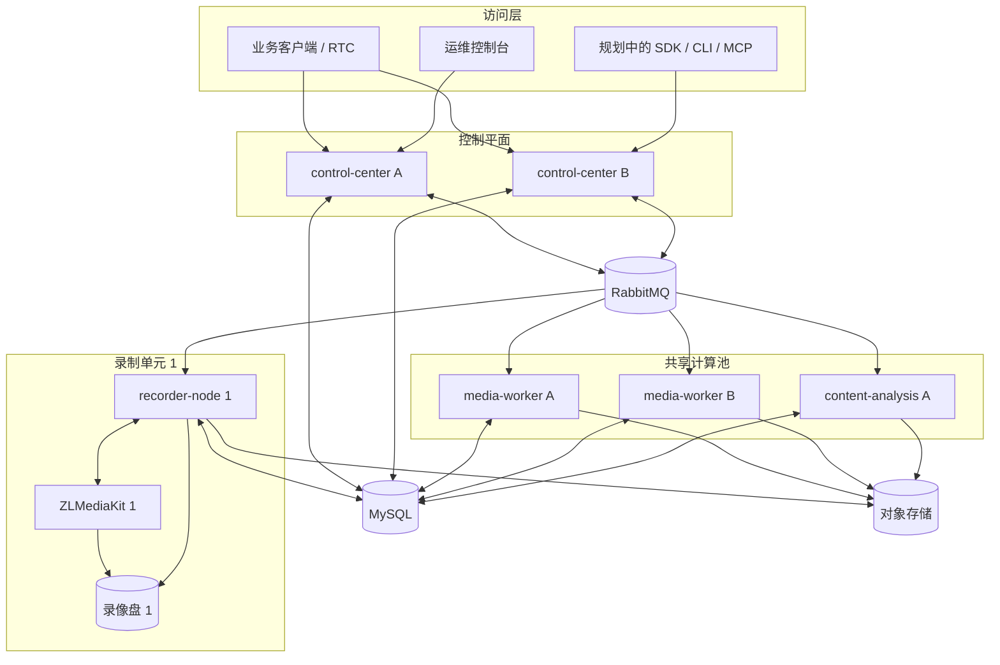
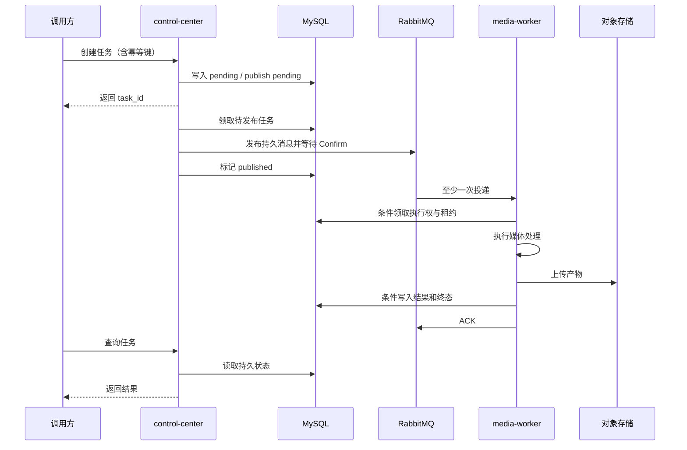

# MediaFleet 总体架构

## 1. 架构目标

MediaFleet 将“接收请求和协调状态”与“执行媒体计算和访问本地文件”分开。控制中心可以
多实例部署，媒体执行节点按能力独立扩展，任何单个进程的重启都不应让任务、绑定或产物
事实永久丢失。

系统遵循以下核心约束：

- MySQL 是节点、绑定、任务、投递状态和媒体产物的持久事实来源。
- RabbitMQ 提供至少一次投递，生产者和消费者都必须接受重复消息并保持幂等。
- 录制命令只路由到拥有对应 ZLMediaKit 和录像文件的录制节点。
- 通用媒体任务由同能力 Worker 竞争消费共享持久队列。
- 离线 ASR 的模型加载和推理只发生在 `media-worker`。
- 控制中心不运行 FFmpeg、不读取录制节点本地目录，也不加载媒体或 AI 模型。
- Redis 与进程内状态可以优化性能，但不能成为分布式正确性的唯一来源。

## 2. 逻辑组件

### 2.1 控制中心 `control-center`

控制中心是对外入口和协调者，负责：

- 提供 REST/OpenAPI、节点注册与心跳、流绑定、任务、录制命令和运维 API；
- 校验请求并以幂等键创建持久任务；
- 根据节点类型、就绪状态、容量和运维状态选择节点；
- 从 MySQL 领取待发布任务或录制命令，等待 RabbitMQ Publisher Confirm 后记录投递状态；
- 消费完成或失败事件，更新任务状态并触发允许的业务回调；
- 提供轻量运维控制台。

控制中心实例不持有“只有本实例知道”的任务事实。多个实例通过 MySQL 条件更新和领取锁
协作，因此请求无需回到创建任务的原实例。

### 2.2 录制节点 `recorder-node`

一个录制节点与一个稳定的录制单元配对，录制单元由 ZLMediaKit、录像目录和
`RECORDER_SERVER_ID` 共同标识。它负责：

- 消费 `recorder.<node_id>.commands` 节点专属队列；
- 执行 `record.start`、`record.stop` 等必须在文件所有者节点运行的命令；
- 检查 ZLMediaKit API、录像目录可写性和磁盘容量，并向控制中心报告心跳；
- 在停止录制后扫描本地分片、探测、合并、提取音频和封面、上传对象存储；
- 将产物和处理阶段写回 MySQL，并在重启后恢复未完成的后处理任务。

流重新绑定不会转移历史文件所有权。涉及历史录像的后处理或删除仍需根据持久记录定位
原拥有节点。

### 2.3 通用媒体 Worker `media-worker`

媒体 Worker 从同一个 `media-worker.tasks` 持久队列竞争消费，负责视频、音频、离线 ASR、
对象检测等通用媒体任务。处理器通过注册表按 `task_type` 选择。

同一队列上的实例必须提供等价能力。如果 CPU、GPU 或模型能力不等价，应先设计独立的
能力队列和明确路由，不能让任务随机落到不支持该能力的实例。

### 2.4 内容分析服务 `content-analysis`

内容分析是可选的独立计算池，使用 `content.analysis.task` Exchange 和
`content-analysis.tasks` 队列。它负责长耗时内容分析、提示词版本和检查点式步骤执行，
避免大模型请求占用通用媒体 Worker。

评课处理在独立任务线程中执行，RabbitMQ 的 Pika I/O 线程只负责心跳和消息结算，避免数分钟
模型调用阻塞 AMQP 心跳。步骤进度和阶段性结果持续写入 MySQL，控制中心查询接口直接读取
这些持久记录；任务已经进入终态但回调未成功时，重复消息只补偿回调，不重新执行评课步骤。

### 2.5 基础设施

| 组件 | 作用 | 是否保存权威事实 |
| --- | --- | --- |
| MySQL | 节点、绑定、任务、投递状态、执行租约、产物、内容分析状态 | 是 |
| RabbitMQ | 任务、命令和事件的可靠传输、重试与死信 | 否 |
| 对象存储 | 最终媒体产物 | 产物内容是，元数据仍需写入 MySQL |
| ZLMediaKit | 流媒体接入与录像 | 本地录像由对应录制节点负责 |
| Redis | 可选缓存或局部协调 | 否 |

## 3. 运行拓扑

## 4. 关键业务链路

### 4.1 通用媒体任务

### 4.2 录制链路

1. 客户端以稳定 `stream_id` 请求绑定，控制中心选择就绪且有容量的录制节点并持久化绑定。
2. RTC 或客户端根据控制中心返回的 ZLMediaKit 地址负责创建或停止摄像头拉流代理。
3. 创建录制任务时，控制中心把目标节点和命令意图写入 MySQL。
4. 调度循环将命令发布到 `recorder.<node_id>` Routing Key，目标节点专属队列消费。
5. 录制节点控制本机 ZLMediaKit；停止后继续在本机完成文件发现与后处理。
6. 录制节点上传产物并更新 MySQL。调用方通过控制中心查询，不依赖某个进程的内存。

## 5. 一致性与故障恢复

系统采用至少一次投递，不承诺消息只到达一次。主要手段包括：

- 请求使用 `request_id` 或 `idempotency_key` 防止重复创建任务；
- 消息具有稳定 `message_id`、`trace_id`、`schema_version` 和业务幂等键；
- 生产者启用 Publisher Confirm，确认失败时保留或释放 MySQL 中的待发布状态；
- 消费者手动 ACK，只有持久结果提交成功后才确认消息；
- 执行者使用条件状态迁移、执行代次和租约拒绝重复执行与过期写入；
- 可恢复错误进入有限延迟重试，不可恢复错误或耗尽重试的消息进入 DLQ；
- 进程重启后从 MySQL 扫描待发布、执行中、后处理中和通知中的记录继续恢复。

详细规则见[数据一致性与消息可靠性](data-and-messaging.md)。

## 6. 扩展原则

- 新 API 复用应用服务，不在路由函数内直接编排数据库和 RabbitMQ。
- 新通用媒体能力优先作为 `media-worker` 处理器；只有依赖、资源和生命周期明显独立时才拆服务。
- 必须访问录像本地目录的能力放在 `recorder-node`，并通过节点定向命令触发。
- 新跨服务字段先更新 `media_platform/contracts`，再同步所有生产者、消费者、测试和文档。
- 新持久状态通过模型、仓储和 Alembic 迁移引入，不能只存在于 Redis 或内存。
- 新入口如 CLI、MCP 和控制台通过 REST/SDK 调用相同应用服务和权限体系。

具体操作步骤见[扩展开发指南](../development/extending-mediafleet.md)。
